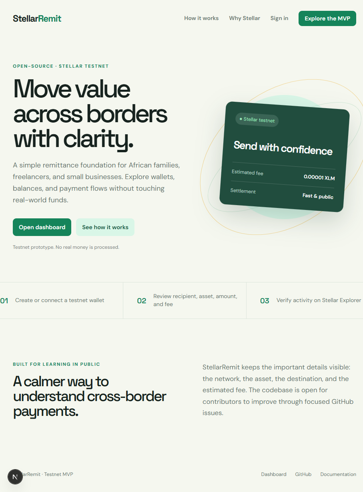
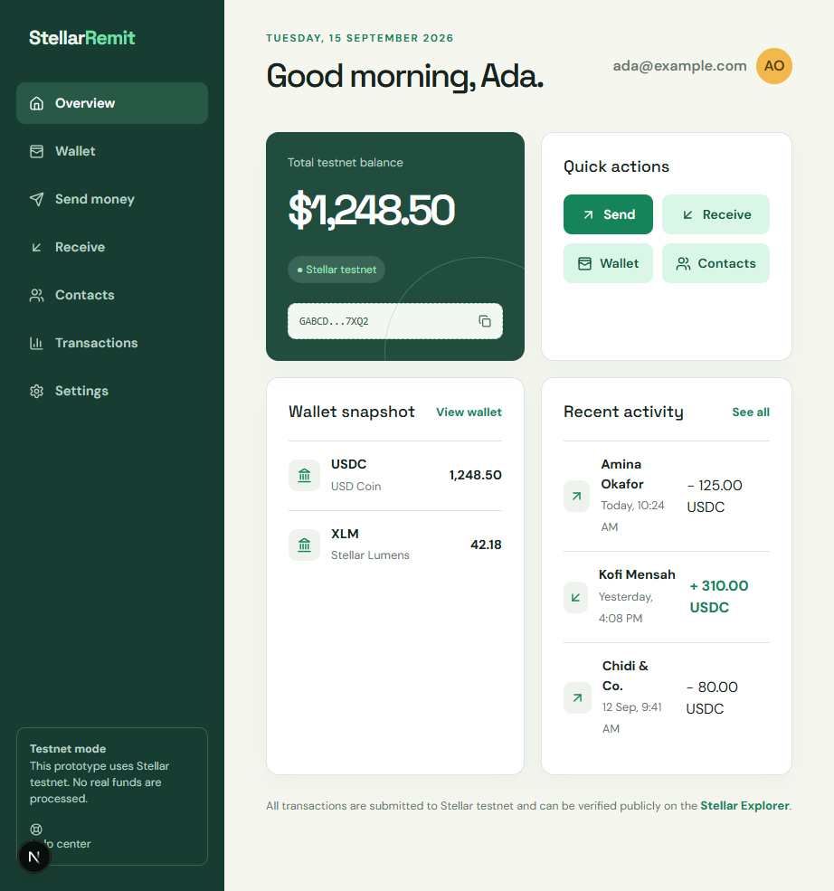

# StellarRemit

StellarRemit is an ongoing open-source, mobile-first cross-border remittance MVP for exploring stablecoin-style payments between African users on the Stellar testnet.

> **This project is currently a testnet prototype and does not process real-world funds.**

## Problem

Cross-border payments can be slow, expensive, and difficult to track. Families, freelancers, and small businesses need a clearer way to move value across borders.

## Solution

StellarRemit provides the foundation for a simple recipient-first experience: Stellar testnet account and balance operations, public-address validation, payment quotes, and a responsive dashboard shell.

## Why Stellar

Stellar offers fast settlement, low predictable fees, and an open ledger that makes payment status independently verifiable. The service is configured for testnet by default so development never requires production funds.

## Features

- Testnet wallet generation and balance lookup
- Stellar public-address validation and payment quotes
- Dedicated service for building, signing, submitting, and checking testnet transactions
- Responsive dashboard shell with wallet, send, receive, contacts, and transaction routes
- PostgreSQL schema for users, wallets, contacts, and transactions
- Strict TypeScript, reusable validation, API health endpoint, and security documentation

## Architecture

```text
apps/web (Next.js UI) -> apps/api (REST) -> packages/validation
                                           -> packages/stellar -> Horizon testnet
                                           -> Prisma/PostgreSQL
```

See [docs/architecture.md](docs/architecture.md) for boundaries and [docs/stellar-integration.md](docs/stellar-integration.md) for the transaction lifecycle.

## Technology Stack

Next.js, React, TypeScript, Tailwind CSS, Lucide, Node.js, Express, PostgreSQL, Prisma, `@stellar/stellar-sdk`, Horizon, Zod, and Vitest.

## Screenshots

### Homepage



### Dashboard



## Installation

Prerequisites: Node.js 20+, npm 10+, and PostgreSQL 15+.

```bash
git clone https://github.com/jamixy/stellar-remit.git
cd stellar-remit
npm install
Copy-Item .env.example .env
```

## Environment Variables

`.env.example` documents all variables. Set `DATABASE_URL`, a long `SESSION_SECRET`, and optionally a testnet USDC issuer. Keep `.env` untracked.

## Database Setup

```bash
npx prisma generate
npx prisma migrate dev --schema prisma/schema.prisma --name init
```

## Stellar Testnet Setup

Use the Stellar testnet faucet to fund development accounts with test XLM. Set `STELLAR_NETWORK=testnet` and use `https://horizon-testnet.stellar.org`. Never put production secret keys in environment files or commits.

## Run Locally

```bash
npm run dev
```

The web app runs at `http://localhost:3000`; the API runs at `http://localhost:4000`.

## Tests, Typecheck, and Build

```bash
npm test
npm run typecheck
npm run build
```

## API Documentation

The initial REST surface is documented in [docs/api.md](docs/api.md). `GET /health`, wallet creation, balance lookup, payment quotes, and transaction lookup are implemented. Authentication, persistence wiring, and payment submission routes remain roadmap work.

## Security Considerations

Secret keys must never be logged, committed, or sent to the browser in production. Development-only import is intentionally not exposed by the current UI. See [docs/security.md](docs/security.md) and [SECURITY.md](SECURITY.md).

## Roadmap and Open Work

The project intentionally stops at a testnet foundation. Authentication, persistence, complete payment confirmation, advanced history, QR enhancements, comprehensive integration testing, and mainnet support are not implemented. See [ROADMAP.md](ROADMAP.md) and open a GitHub Issue before starting work. Contributions should arrive through focused pull requests.

## Contributing and License

Read [CONTRIBUTING.md](CONTRIBUTING.md), [CODE_OF_CONDUCT.md](CODE_OF_CONDUCT.md), and [SECURITY.md](SECURITY.md). This project is available under the MIT license.